# InfluencerFlow AI

FastAPI backend for the InfluencerFlow AI influencer marketing platform.

Website snapshot:


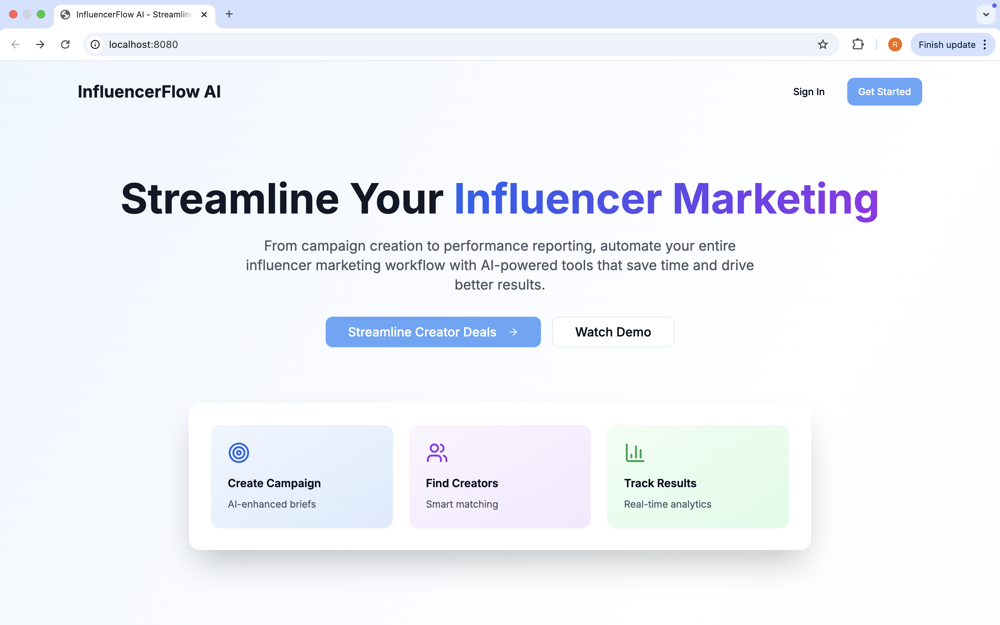
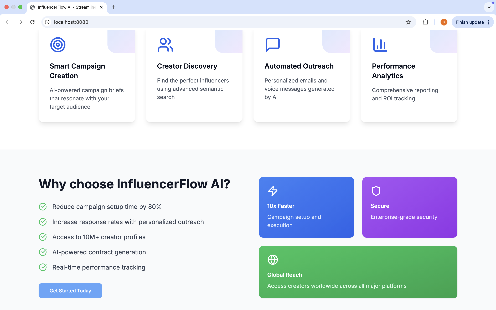
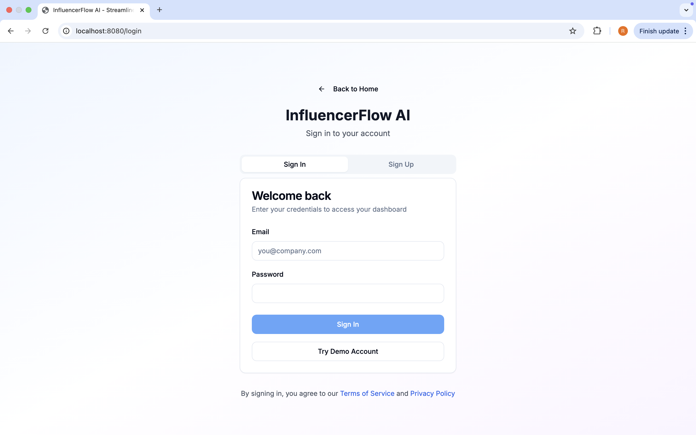
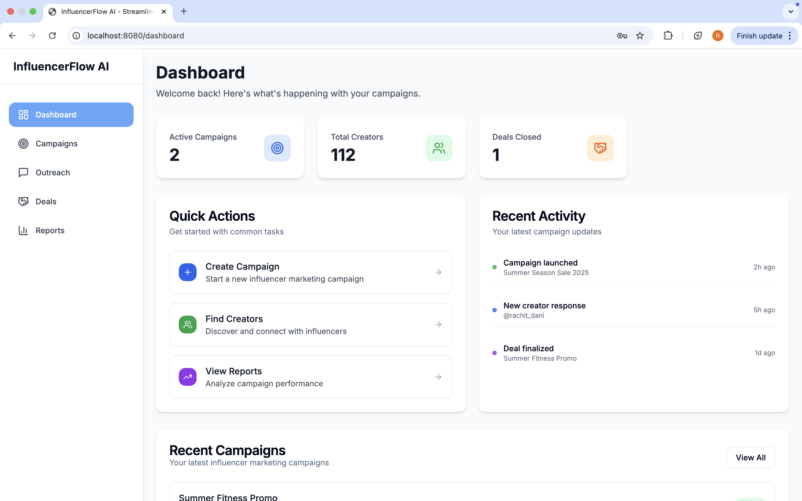
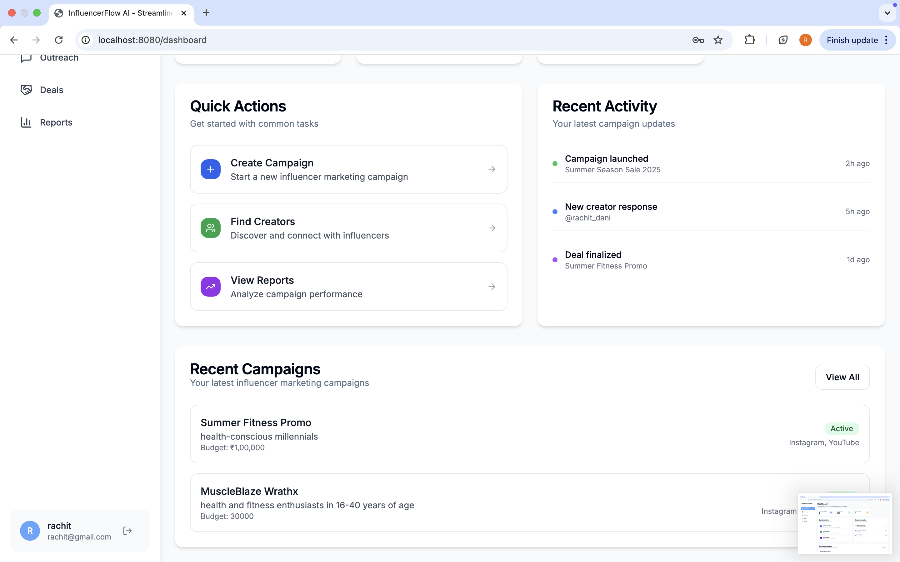
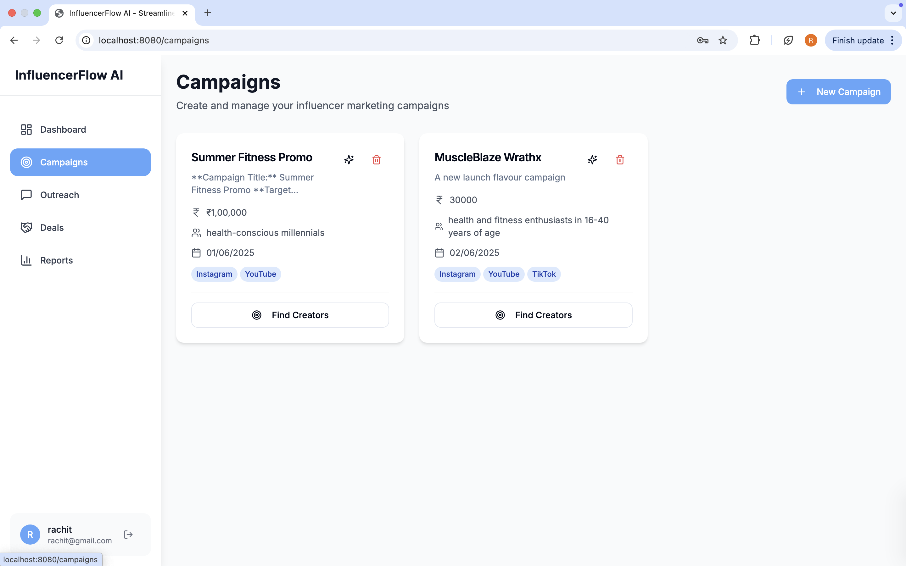
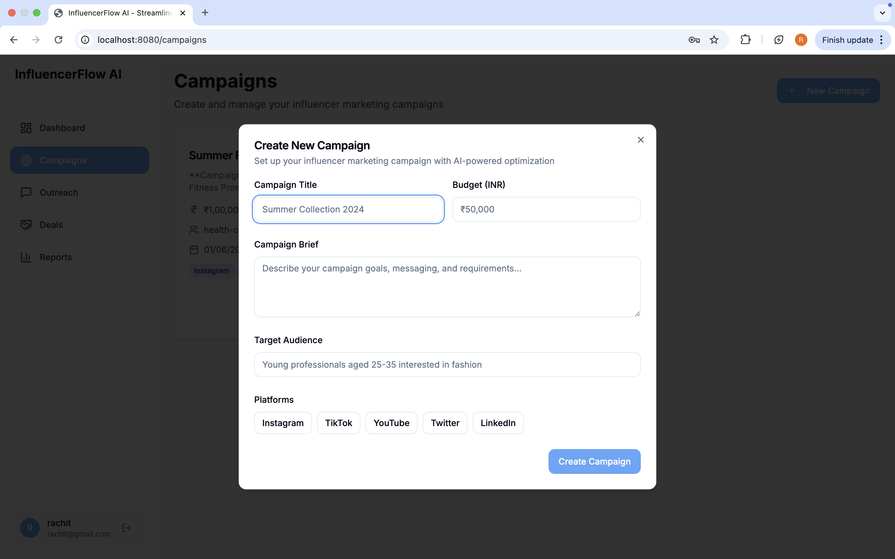
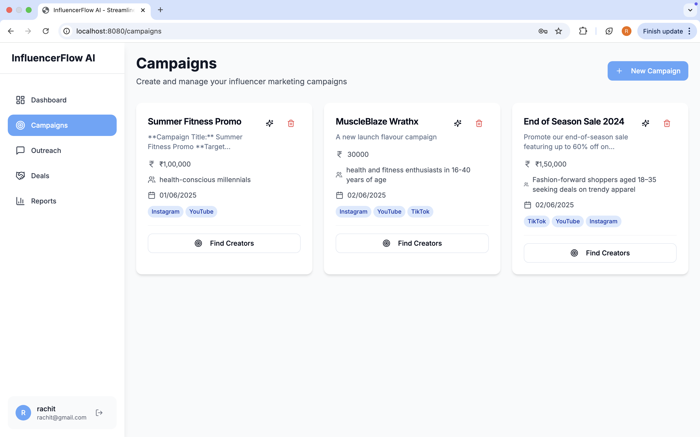
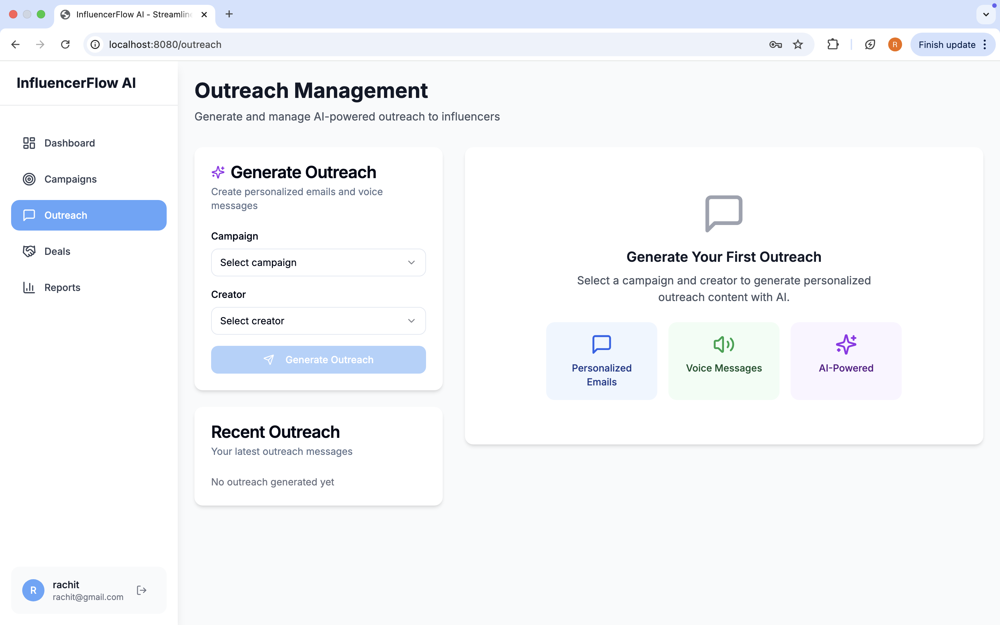
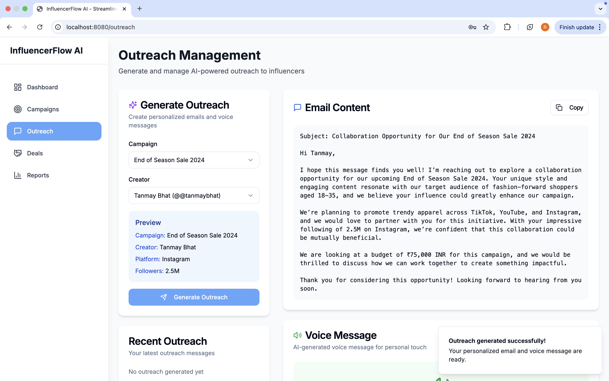
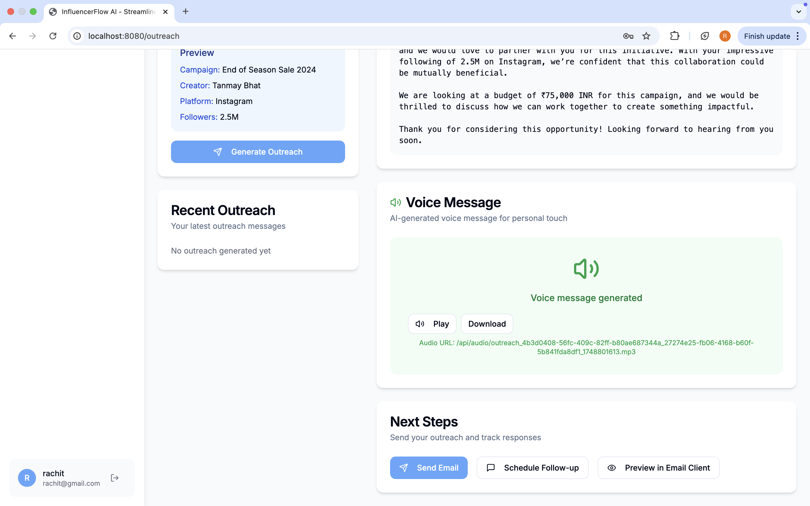
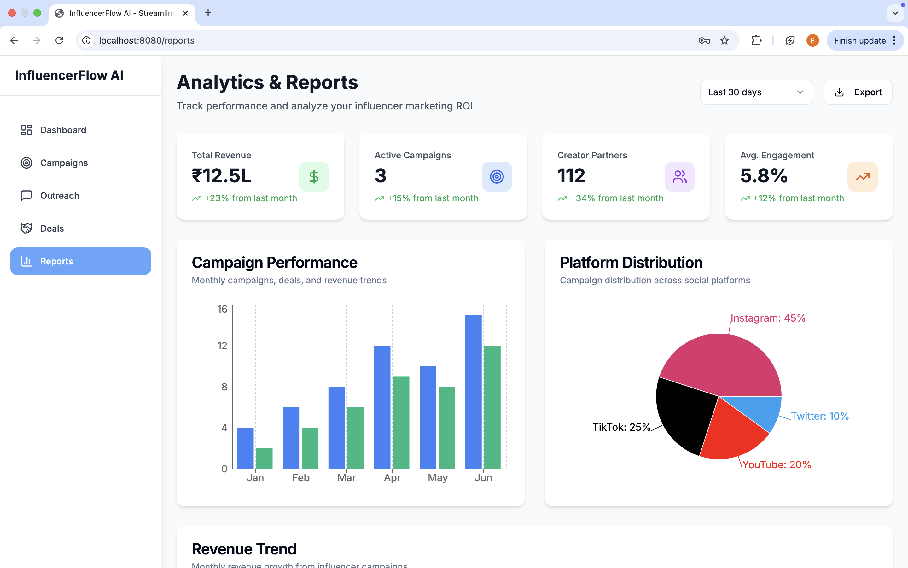
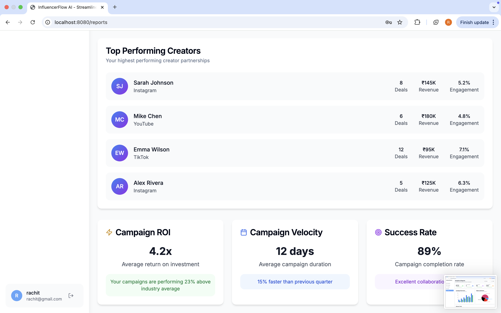


## Features

- **Campaign Creation**: Create and enhance campaigns with AI
- **Creator Discovery**: Search and filter creators
- **AI Outreach**: Generate personalized outreach emails and voice messages
- **Voice Negotiation**: Real-time AI-powered negotiation with voice transcription
- **Deal Finalization**: Finalize deal terms and conditions
- **Contract Generation**: AI-generated contracts with PDF export

## Setup

1. **Install Dependencies**
```bash
cd backend
python -m venv .venv
source .venv/bin/activate
pip install -r requirements.txt
```

2. **Environment Variables**
Create a `.env` file with:
```
OPENAI_API_KEY=your_openai_api_key
ELEVENLABS_API_KEY=your_elevenlabs_api_key
SUPABASE_URL=your_supabase_url
SUPABASE_KEY=your_supabase_key
ELEVENLABS_AGENT_ID=your_elevenlabs_agent_id
PINECONE_API_KEY=your_pinecone_api_key (optional)
```

3. **Run the Server**
```bash
uvicorn main:app --reload
```

The API will be available at `http://localhost:8000`

## API Documentation

Once running, visit:
- API docs: `http://localhost:8000/docs`
- Alternative docs: `http://localhost:8000/redoc`

## API Endpoints

### Campaign Management
- `POST /api/campaigns` - Create campaign
- `POST /api/campaigns/{id}/enhance-brief` - AI enhance brief
- `GET /api/campaigns/{id}` - Get campaign

### Creator Discovery
- `GET /api/creators` - List creators with filters
- `POST /api/creators/search` - AI semantic search

### Outreach
- `POST /api/outreach` - Generate outreach content
- `GET /api/outreach/{campaign_id}/{creator_id}` - Get outreach

### Negotiation
- `POST /api/negotiations/transcribe` - Transcribe audio
- `POST /api/negotiations/respond` - AI negotiation response
- `GET /api/negotiations/{campaign_id}/{creator_id}` - Get history

### Deal Management
- `POST /api/deals` - Create deal
- `GET /api/deals/{id}` - Get deal details

### Contract Generation
- `POST /api/contracts/generate` - Generate contract
- `GET /api/contracts/download/{deal_id}.pdf` - Download PDF

## Tech Stack

- **FastAPI**: Modern Python web framework
- **OpenAI GPT-4**: Text generation and enhancement
- **ElevenLabs**: Voice synthesis and audio processing
- **ReportLab**: PDF generation
- **Pydantic**: Data validation

## Development

To run in development mode:
```bash
uvicorn main:app --reload --host 0.0.0.0 --port 8000
```
------------------------------

For frontend development, 
run:
```bash
cd frontend
npm run dev
```     

Now open the frontend in your browser:
```bash
http://localhost:8080/
```

